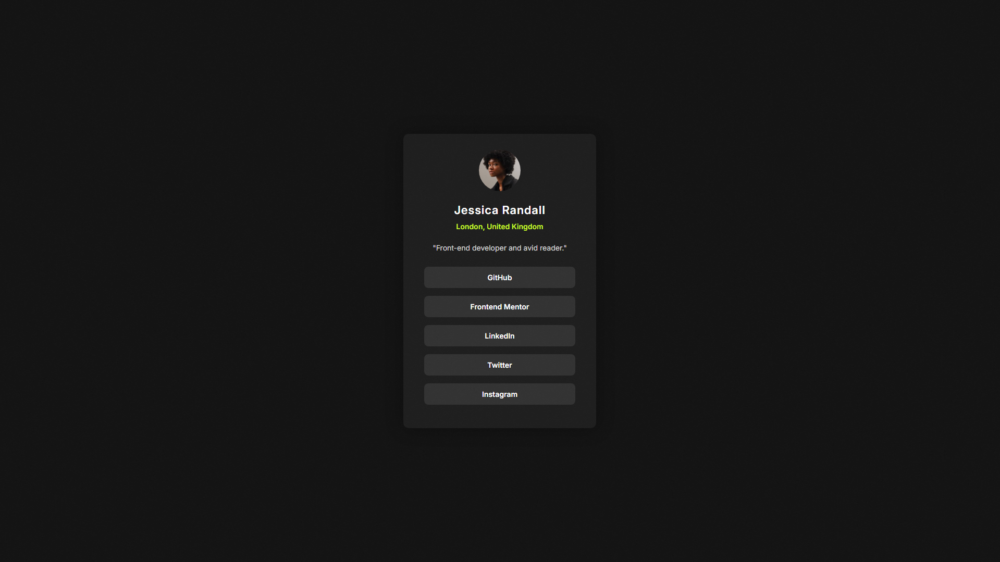

# 🌟 Social Links Profile - Frontend Mentor Solution 🌟

This repository contains my solution for the [Social Links Profile Challenge on Frontend Mentor](https://www.frontendmentor.io/learning-paths/getting-started-on-frontend-mentor-XJhRWRREZd/steps/66e99a4e5832c087f2209e1f/challenge/start). The goal is to build a responsive social profile card, complete with interactive states and clean design. 🚀

---

## 📋 Content

- [🔍 Overview](#-overview)
    - [🖼 Screenshot](#-screenshot)
    - [🔗 Links](#-links)
- [⚙️ My Process](#-my-process)
    - [🛠 Built With](#-built-with)
    - [📚 What I Learned](#-what-i-learned)
- [👨‍💻 Author](#-author)

---

## 🔍 Overview

### 🖼 Screenshot

### 🔗 Links

- [📂 Repository](https://github.com/Hamptooon/social-links-profile)
- [🌐 Live Demo](https://Hamptooon.github.io/social-links-profile)

---

## ⚙️ My Process

### 🛠 Built With

- ✅ **Semantic HTML5**
- 🎨 **CSS Flexbox**
- 📱 **Responsive Design**
- 🧩 **SCSS Mixins for reusable styles**

### 📚 What I Learned

This project enhanced my knowledge of:

- **Flexbox** for layout structure.
- **SCSS Mixins** to simplify repetitive styles and make the code more modular.

---

## 👨‍💻 Author

- GitHub - [Hamptooon](https://github.com/Hamptooon)
- Frontend Mentor - [Hamptooon](https://www.frontendmentor.io/profile/Hamptooon)

---

🔧 This project is part of my continuous learning journey in front-end development. Feel free to fork, contribute, or star this project! ⭐️